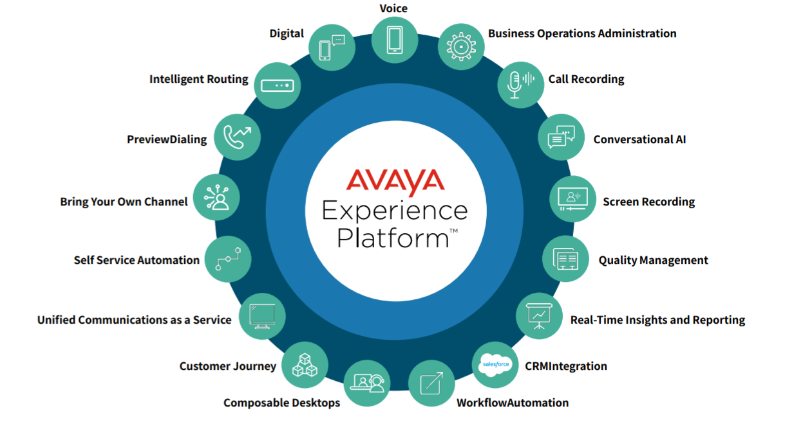

<link rel="stylesheet" type="text/css" href='./extra.css'/>

# Welcome to Avaya Experience Platform™

### This repository serves as a guide for getting started with building and customizing on Avaya Experience Platform™.

Avaya Experience Platform™ is a contact-center-as-a-service solution that provides a suite of capabilities to orchestrate,
track, interact and report across voice and digital (email, chat and messaging) channels. It is built on an open, API-first
architecture leveraging REST based APIs for all capabilities to enable easy customization and integration into an Avaya
Experience Platform Customer’s back/front office ecosystem. 

Avaya Experience Platform™ makes it easy to connect everything—voice, video, chat, messaging, and more—to deliver effortless experiences for customers and employees at every touchpoint. And it brings together teams, resources, and insights to maximize contact center performance and experiences.

    

## Avaya Experience Platform™ APIs
Avaya Experience Platform™ offers public APIs enabling customers to extend the core functionality to build additional experiences. 

[Avaya Experience Platform™ APIs](https://developers.avayacloud.com/avaya-experience-platform) provide a powerful toolkit for contact centers to elevate their customer service to new heights. By leveraging automation, AI, and custom integrations, businesses can deliver effortless experiences, connect with customers across various channels, and optimize overall contact center performance. The result is improved customer satisfaction, increased operational efficiency, and a competitive advantage in today's ever-evolving business landscape.

Through Avaya Experience Platform™ APIs, businesses can automate various processes to streamline operations and improve efficiency. Automated call routing ensures customers are connected to the right agent quickly, reducing wait times and enhancing satisfaction. With AI-powered chatbots and virtual assistants, routine inquiries can be handled 24/7, freeing up agents to focus on more complex issues. Natural language processing and sentiment analysis capabilities also enable intelligent call handling, understanding customer emotions, and adapting responses accordingly.

Furthermore, businesses can create custom third-party integrations that align with their specific needs and workflows. By integrating customer data from CRM systems, businesses gain a comprehensive view of each customer's history and preferences, facilitating personalized interactions. Integrations with ticketing systems allow seamless issue resolution and follow-up, fostering stronger customer relationships.

## Content

- [Avaya Experience Platform™ Sample Applications](#sample-applications)
- [Avaya Experience Platform™ SDKs](#sdks)
- [Avaya Workspaces Widgets](#workspaces-widgets)
- [Other Resources](#other-resources)

## Sample Applications

Sample applications leveraging [Avaya Experience Platform™ APIs](https://developers.avayacloud.com/avaya-experience-platform) and third-party integrations

> :bulb: These sample applications are provided **for demonstration purposes only** and are **not** intended for production use. We assume no responsibility for any issues arising from their use.

- [Custom Messaging Connector - Sample SMS Integration](https://github.com/AvayaExperiencePlatform/sms-async-messaging-connector-sample)
- [Omni SDK - Andriod Messaging Sample App](https://github.com/AvayaExperiencePlatform/omni-sdk-android/tree/master/sample-app-messaging)
- [Omni SDK - Web Messaging Sample App](https://github.com/AvayaExperiencePlatform/omni-sdk-js/tree/master/sample-app-messaging)
- [Omni SDK - Starter Kit (Authentication & Push Notifications)](https://github.com/AvayaExperiencePlatform/omni-sdk-starter-kit)
- [Chat SDK - Reference Client & Backend](https://github.com/AvayaExperiencePlatform/chat-sdk-js/tree/main/reference-applications)
  
## SDKs

### Digital

- [Omni SDK (Messaging) - JavaScript (Web)](https://github.com/AvayaExperiencePlatform/omni-sdk-js)
- [Omni SDK (Messaging) - Android](https://github.com/AvayaExperiencePlatform/omni-sdk-android)
- [Chat SDK - JavaScript](https://github.com/AvayaExperiencePlatform/chat-sdk-js)
  
### Workspaces

- [Workspaces Widget Framework SDK](https://documentation.workspaces.avayacloud.com/widget-framework/docs/api-reference/introduction) 

## Workspaces Widgets

### Workspaces Basic Widgets

Basic sample widgets showcasing [Workspaces Widget Framework SDK](https://documentation.workspaces.avayacloud.com/widget-framework/docs/api-reference/introduction)'s Events & Methods.

- [Workspaces Basic Widgets](https://github.com/AvayaExperiencePlatform/workspaces-basic-sample-widgets)

### Sample Custom Widgets
Sample custom widgets leveraging [Workspaces Widget Framework SDK](https://documentation.workspaces.avayacloud.com/widget-framework/docs/api-reference/introduction) & [Avaya Experience Platform™ APIs](https://developers.avayacloud.com/avaya-experience-platform).

> :bulb: These sample widgets are provided **for demonstration purposes only** and are **not** intended for production use. We assume no responsibility for any issues arising from their use.

- [Getting Started - React](https://github.com/AvayaExperiencePlatform/getting-started-widget-react)
- [Agent Queues & Attributes Manager](https://github.com/AvayaExperiencePlatform/agent-matching-config-widget)
- [Queue Metrics](https://github.com/AvayaExperiencePlatform/queue-metrics-widget)
- [CLID Selector](https://github.com/AvayaExperiencePlatform/clid-selector-widget)
  
## Other Resources
- [Avaya Neo](https://design.avayacloud.com/): Build applications and widgets with the same look and feel as Avaya Experience Platform™ applications.
    - [Avaya Neo React](https://www.npmjs.com/package/@avaya/neo-react).
    - [Avaya Neo CSS Framework](https://www.npmjs.com/package/@avaya/neo).
- [Avaya Experience Platform™ Postman Documentation](https://www.postman.com/avaya-axp/workspace/avaya-experience-platform/overview): Postman collections loaded with latest Avaya Experience Platform™ APIs, ready to go.

## Discussions

If you have any questions please join our [discussion forum](https://developers.avayacloud.com/avaya-experience-platform/discuss) on our developer portal.

## Contributing

Contributions welcome! Read the [contribution guidelines](contribution.md) first.
